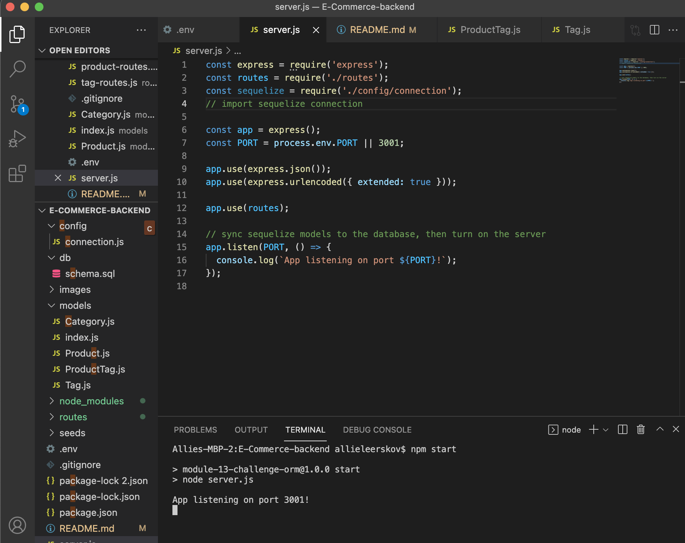

# E-commerce Back End 

## Purpose
Backend E-commerce inventory manager. Gives retailer the ability to manage store inventory from the URL and command line.

## Built With
* MySQL
* Sequelize
* Javascript
* Express.js
* Node

## Website
https://github.com/AllanaLeerskov/E-Commerce-backend

## Contribution
Made with ❤️ by Allana